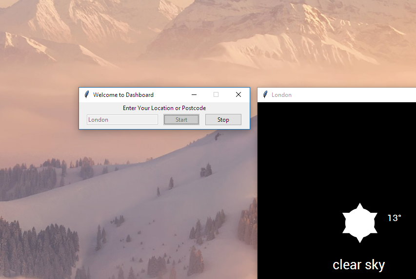
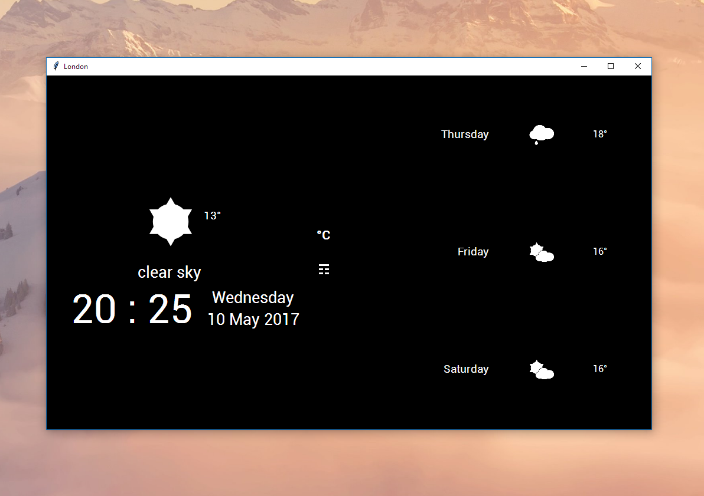
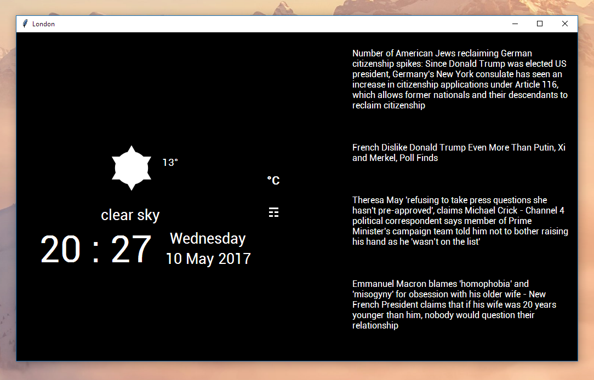

# JAMM
## Just Another Magic Mirror. 
A simple, interactive dashboard app, created in Python.

The dashboard displays the time and weather as well as forecasts and top 
news stories.  
Clicking or touching individual news stories pushes (pushbullet required) 
them to your smartphone or tablet.

The dashboard was originally intended to be used with a RaspberryPi and runs
 at 1024x600 resolution.
 
### Requirements/Installation

+ Open Weather Maps

    The app gets its weather data from Open Weather Maps so you will need an API
     Key 
     Sign up and get one from [here](http://openweathermap.org/appid 
     "OpenWeatherMaps, How to get API key"), 
     its free.

+ Pushbullet

    You will also need a Pushbullet account and an Api Key to push news stories to 
    your smart device. 
    You can find this [here](https://www.pushbullet.com/#settings/account 
    "Pushbullet Account Settings"), also free.

Once you have both of these, edit the **config.ini** file to include the Api 
Keys. Make sure you have also installed dependencies from the **requirements
.txt** file.

### Screenshots

Launcher: 
    
    
Dashboard Forecasts: 
    
    
Dashboard News: 
        
    
### Credits

Icons used  from <http://websygen.github.io/owfont/> created by [Deniz 
Fuchidzhiev](http://websygen.com/)

### Authors 

Developed and maintained by [Rhys Fernandes](https://github.com/rhys-fernandes)
